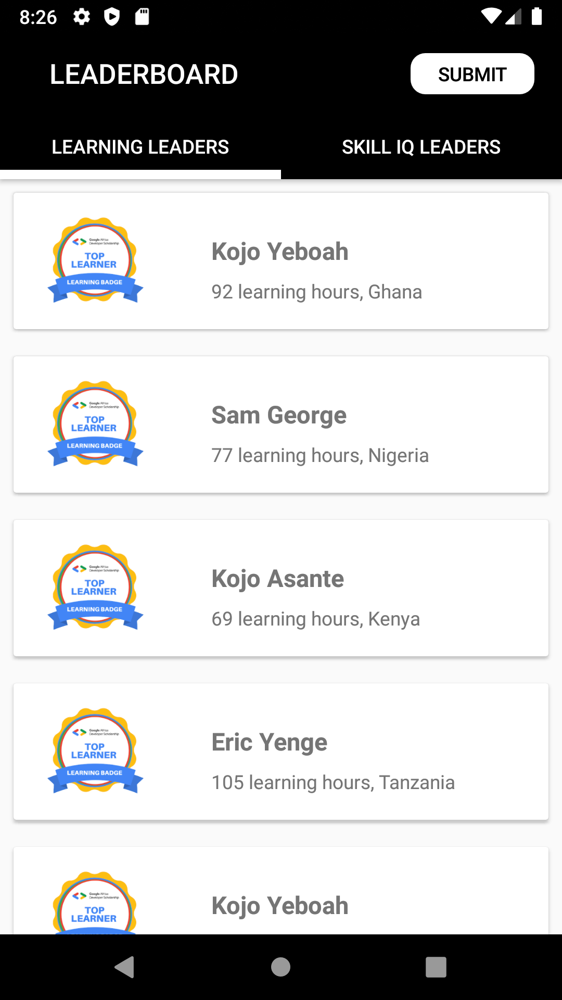
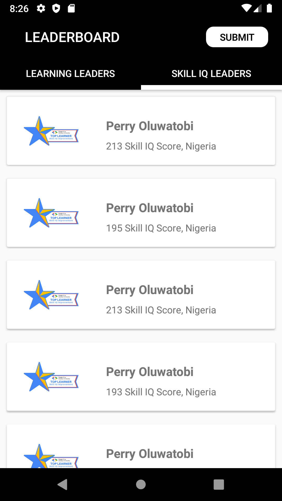
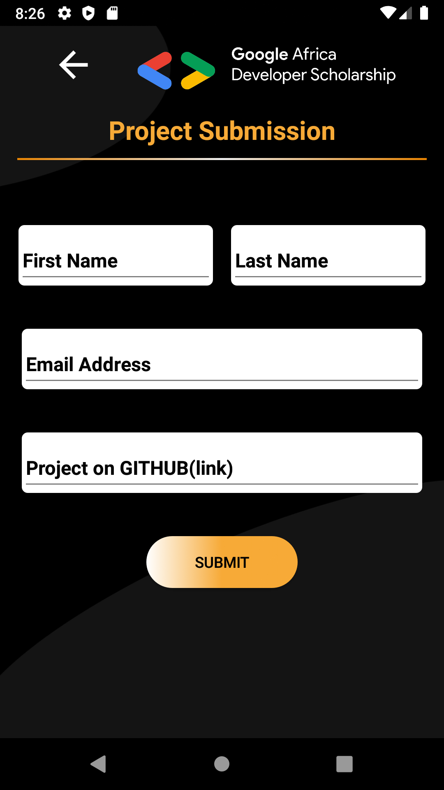
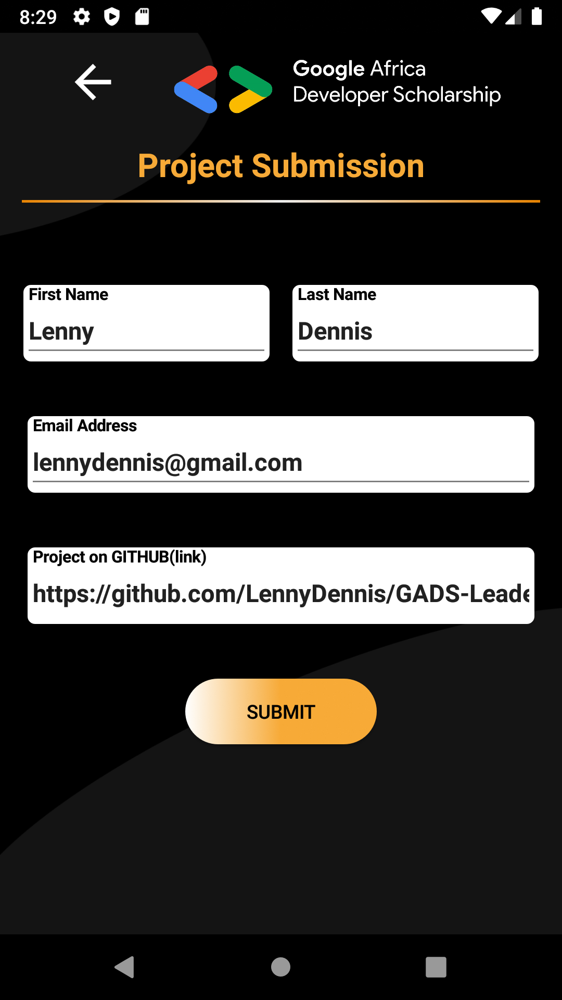
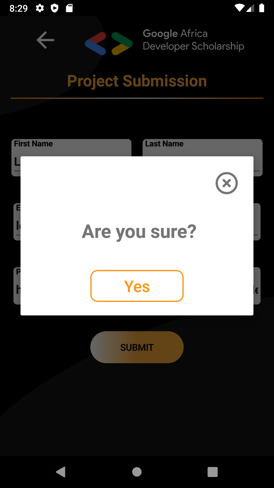
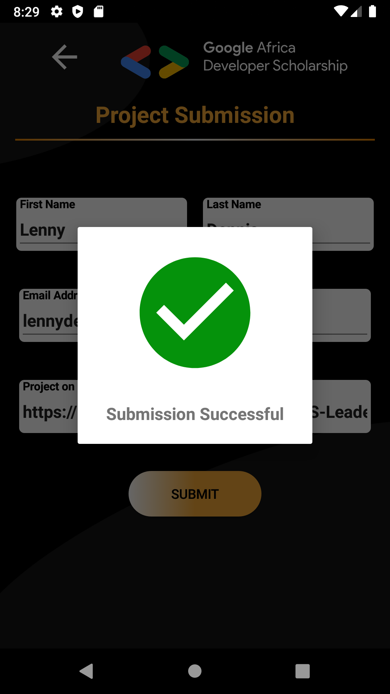
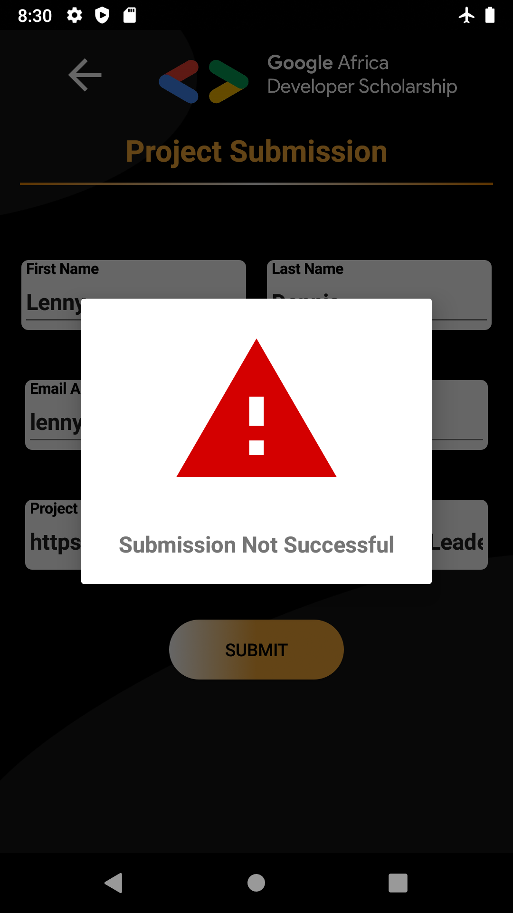

# GADS Leaderboard  Yangu

[GADS Leaderboard App](https://github.com/LennyDennis/GADS-Leaderboard-App) this is a mobile application that displays the learning hours and skill IQ scores leaderboards for the GADS 2020.

# Built With
Java
Glide
Retrofit
MVVM
DataBinding

# Application Screenshots

# License
*MIT License

# Copyright (c) [2020] [Lenny Dennis Macharia]

Permission is hereby granted, free of charge, to any person obtaining a copy of this software and associated documentation files (the "Software"), to deal in the Software without restriction, including without limitation the rights to use, copy, modify, merge, publish, distribute, sublicense, and/or sell copies of the Software, and to permit persons to whom the Software is furnished to do so, subject to the following conditions:
